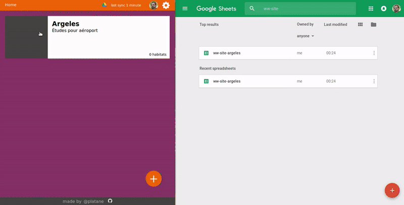

# Usage

The app is pretty simple.

Keep in mind that everything you do is reflected in your google doc spreadSheet.

## Create a site

Being logged to the application _( left on the screenshot )_, you can fill up a form to create a new site.

Once that done, the status in the header will indicate that it is effectively persisted in a new google doc spreadSheet.

You can access your google doc spreadSheet _( rigth on the screenshot )_. You should see a new one.

## Create an habitat

Same thing, fill the form to create an habitat.

The app will create one sheet _( tab at the bottom of the google doc spreadSheet )_ per habitat.

Notice how the data in the google doc spreadSheet is kept in sync as we work with the app _( rigth on the screenshot )_.
