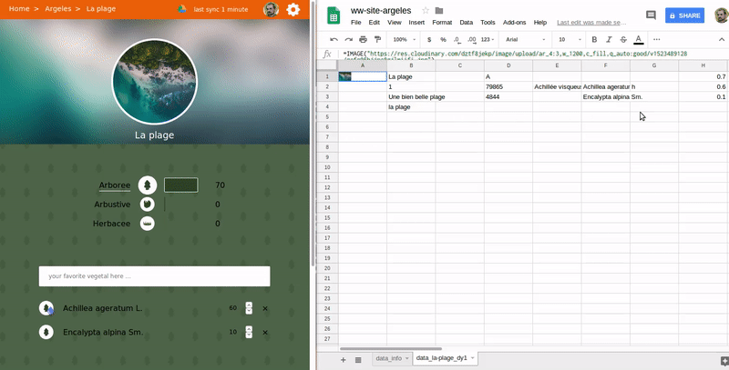
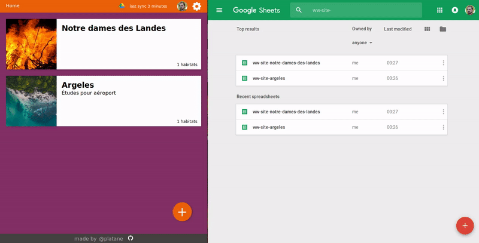

## Editing from the google doc spreadSheet

You can also edit the data right from the google doc spreadSheet. The app will pick it up when it synchronize.

It does synchronize automatically every 15min, but you can force a refresh at anytime.

**Edit habitat**

> This screenshot show how to edit a vegetal directly from google doc spreadSheet

**Edit site**

> This screenshot show how to remove a site from google doc spreadSheet
